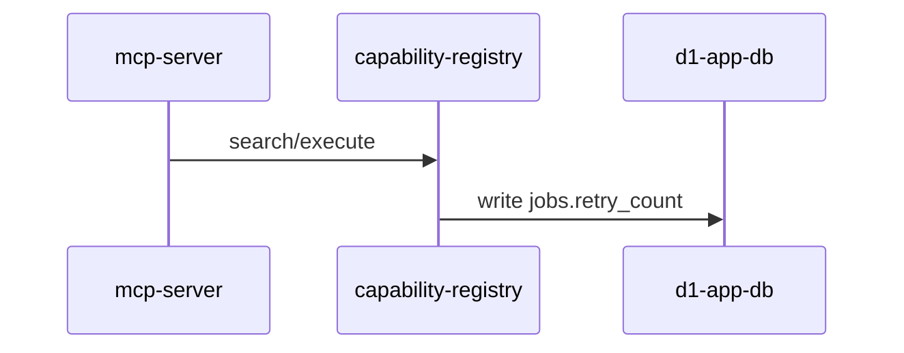
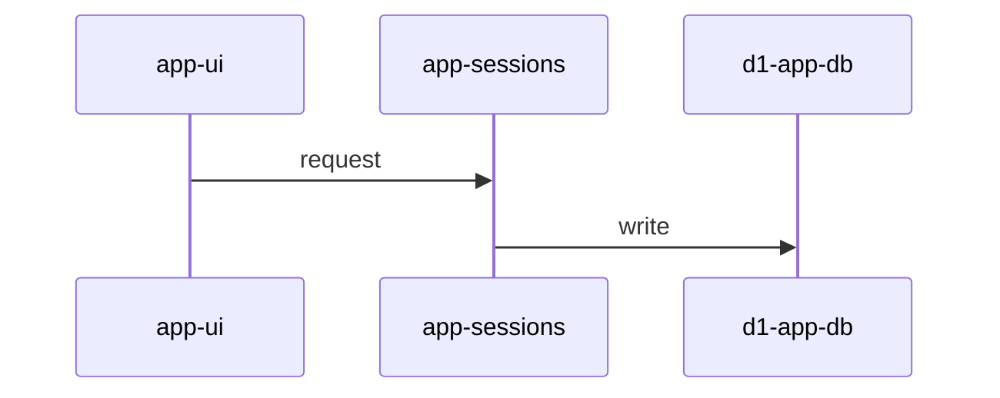
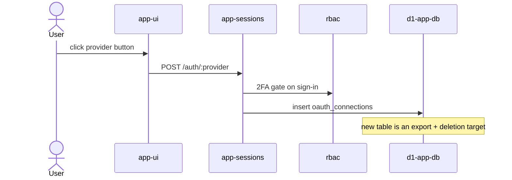
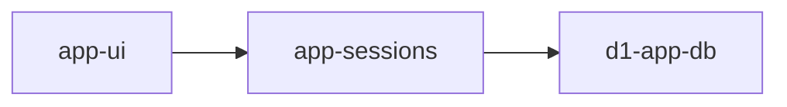
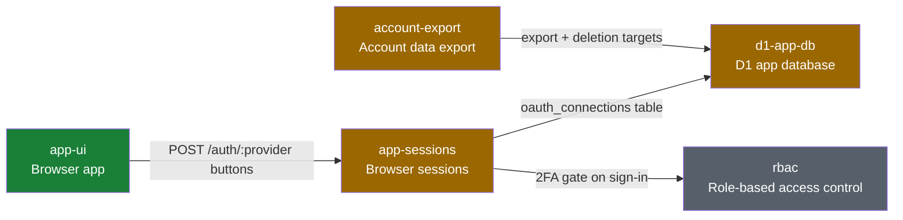

# System recap (visual plan / visual recap)

Produce a high-altitude, visual review aid directly in the PR description. No
deployment, no third-party service: GitHub renders the block (including mermaid
diagrams), and the PR itself is the storage. The marker-delimited block is
machine-readable via the GitHub API, so follow the format exactly.

The recap is informational and non-blocking. It supplements the PR description
and normal code review; it never replaces reading the diff.

## Two modes, one format

- **Plan mode** (before/while implementing): describe the intended change
  against the current system. If no PR exists yet, put the block in the plan
  document or message; move it into the PR description once the PR exists.
- **Recap mode** (PR creation and every meaningful update): describe what the
  diff actually does. Replaces a plan-mode block if one exists.

## Source-of-truth rules (non-negotiable)

1. **Recap mode reads the diff, not memory.** Generate the recap from
   `git diff <base>...HEAD` (plus `git diff --stat`) against the PR base branch.
   Session context may explain intent, but every claim about what changed must
   be checkable against the diff.
2. **Classification uses the primitives taxonomy.** Read
   [`docs/contributing/architecture/primitives.yaml`](../../../docs/contributing/architecture/primitives.yaml)
   for stable `id` / `name` / `group` values. Prefer the classifier script over
   hand-matching paths:

   ```bash
   node .agents/skills/visual-recap/scripts/classify-primitives.mjs --base <base> --head HEAD
   # or: git diff --name-only <base>...HEAD | node .../classify-primitives.mjs --stdin --json
   ```

3. **The taxonomy is not a feature changelog.** Update `primitives.yaml` only
   when this PR **adds, removes, or materially reshapes** a primitive (new `id`,
   renamed meaning, or ownership roots that must change). Do **not** edit
   `summary` for ordinary feature work — put behavioral detail in the linked
   architecture docs under `docs:`. Run `npm run primitives:check` after map
   edits.

## Risk classification

Classify each touched primitive, then roll up to the highest severity as the
overall classification (`adds` > `extends` > `composes`):

| Classification | Meaning                                                    | Risk   |
| -------------- | ---------------------------------------------------------- | ------ |
| `composes`     | Uses existing primitives as-is; wiring and call sites only | Low    |
| `extends`      | Changes a primitive's behavior, shape, or contract         | Medium |
| `adds`         | Introduces a new primitive (must update primitives.yaml)   | High   |

A change touching invariants from `primitives.yaml` (for example per-user
isolation) is called out explicitly regardless of classification.

The classifier reports which primitives' `code` roots the diff touches; you
still decide `composes` vs `extends` from the diff (and `adds` when you create a
new map entry).

## Choosing a diagram

Pick the mermaid graph that best explains **this PR's** change. Do not default
to a topology flowchart.

- **Sequence diagram (preferred):** request or job timing, who calls whom, and
  what this PR adds or changes on each hop. This is the usual choice.
- **Flowchart / system map:** many-to-many wiring, fan-out, or a crossing that
  is awkward as a single timed path. Useful **in addition** to a sequence
  diagram when topology is the story.
- **Other mermaid types** when they fit better: `erDiagram` for schema,
  `stateDiagram-v2` for lifecycle, `flowchart TB` for a decision tree. Use them
  instead of (or alongside) a sequence diagram — do not force a sequence diagram
  that hides the real change.

Every diagram is PR-scoped: only the path this diff changes, not the full
architecture. Open with one sentence naming what the graph shows. **Label every
arrow or message** with what this PR does across that boundary (route, handler,
table/column, guard, capability, env var). Unlabeled arrows are forbidden.

Include at least one diagram. Add a second only when it shows something the
first cannot (for example a sequence for timing plus a small ER snippet for a
new table). Do not restate the same path in two graphs.

## Block format

The block lives in the PR description between HTML comment markers, wrapped in
`<details>`. Fixed section order — keep the structure stable so the
marker-delimited block stays machine-readable. Omit optional sections rather
than leaving them empty.

````markdown
<!-- system-recap:start -->

<details>
<summary>System recap — <b>composes existing primitives</b> (low risk)</summary>

**Mode:** recap · **Base:** `main` @ `abc1234` · **Head:** `def5678`

**Classification:** composes — no primitives added or changed; this PR wires
existing primitives together.

### Primitives touched

| Primitive    | Group    | Impact                                  |
| ------------ | -------- | --------------------------------------- |
| `mcp-server` | surfaces | composes                                |
| `d1-app-db`  | storage  | extends — new `jobs.retry_count` column |

### Change flow

Search/execute records a retry count on the job row.



### System map

_Optional: a topology flowchart when a sequence diagram is not enough, or when a
second view of crossings helps._

### Before / after

_Optional: schema, API shape, or route changes as compact before/after fenced
blocks or tables._

### Invariants

_Optional: only when the change touches an invariant from primitives.yaml._

### Plan vs actual

_Recap mode only, when a plan-mode block existed: what shipped as planned and
what drifted, in a short list._

</details>

<!-- system-recap:end -->
````

Format rules:

- The `<summary>` line always carries the overall classification and risk in
  bold so reviewers see it without expanding.
- Blank line after `<summary>` and around every fenced block, or GitHub will not
  render the markdown/mermaid inside `<details>`.
- **Change flow** (preferred visual): usually a mermaid **sequence diagram** of
  the changed path. Rules:
  - Open with one sentence naming the main flow (e.g. "Social login flows from
    the login UI through session auth into D1.").
  - Participants are primitives: use the `id` as the alias (e.g.
    `participant appSessions as app-sessions`). Add an `actor` only when a human
    or external caller is part of the change.
  - **Label every message** with what this PR does on that hop. Unlabeled
    messages are the sequence-diagram form of unlabeled flowchart arrows.
  - Include only participants on the changed path — not all ~25 primitives. Add
    a neighbor only when this PR actually calls through them.
  - Use `Note over` / `Note right of` for new or changed data, guards, or status
    — not as a substitute for a labeled message.
  - Do not put `;` in sequence notes or messages: mermaid ends the statement
    there, and GitHub then fails on leftover tokens (often `+`). Rephrase
    (`and`, a comma) instead of quoting. `npm run mermaid:check` and
    `upsert-recap-block.mjs` parse every fenced mermaid block the way GitHub
    does.
  - Keep the happy path first. Use `alt` / `opt` only for a branch this PR
    introduces or changes.
- **System map** (optional): a PR-scoped **topology** view — how touched
  primitives connect because of this diff. Use when a sequence diagram cannot
  show fan-out, ownership, or several crossings at once. Rules when you include
  one:
  - Include the **legend** line directly above the flowchart, using this fixed
    wording: green = composes (wiring only) · amber = extended by this PR · red
    = new primitive · gray = context (unchanged, included only when an edge
    crosses it).
  - Node labels: primitive `id` plus the `name` from `primitives.yaml` on a
    second line via `<br/>` (e.g.
    `appSessions["app-sessions<br/>Browser sessions"]`).
  - Color nodes with the four `classDef` styles (`touched` = composes,
    `extended`, `added`, `untouched` for context-only nodes).
  - **Label every edge.** Prefer fewer, labeled edges over chaining unlabeled
    `A --> B --> C` hops.
  - Quote node labels containing spaces or special characters.
  - Skip this section when the sequence diagram already covers the path,
    including storage or cross-cutting hops (DB, RBAC, export).
- Other mermaid types follow the same labeling and PR-scope rules. Put an
  `erDiagram` or `stateDiagram-v2` in **Change flow** (or **Before / after** for
  a compact schema snippet) when that graph is the clearest.
- Keep the whole block scannable: prefer tables and diagrams over prose, and
  keep it well under ~120 lines.

## Workflow

### Recap mode (PR create/update)

1. Resolve base/head (`gh pr view <n> --json baseRefName,headRefName`).
2. Classify paths:

   ```bash
   node .agents/skills/visual-recap/scripts/classify-primitives.mjs --base <base> --head HEAD --json
   ```

3. Read the full diff for anything you did not author this session; decide
   composes/extends/adds per matched primitive (and note important unmatched
   paths if they introduce a new surface).
4. Author the block following the format above. Use map `name` for participant
   and node labels; pull behavioral detail from architecture docs / the diff,
   not by rewriting map summaries. Choose the graph type using **Choosing a
   diagram**.
5. Upsert it into the PR description.

   Validate mermaid and compute the merged body:

   ```bash
   node .agents/skills/visual-recap/scripts/upsert-recap-block.mjs <pr-number> <block-file>
   ```

   The script rejects mermaid GitHub cannot parse, then replaces the content
   between the markers, or appends the block to the end of the description on
   first run. It never touches text outside the markers.

   **Cloud Agents:** `gh pr edit` fails with
   `Resource not accessible by integration (updatePullRequest)`. Do not treat
   that as a reason to skip the recap. Run the script anyway so mermaid is
   checked; when it prints the merged PR body, apply that body with Cursor
   **ManagePullRequest**. Do not have Kody, a Kody workflow, or Kody's GitHub
   integration edit the PR.

6. Re-run steps 2-5 after pushing significant new commits to the PR.

When the recap is **medium** (`extends`) or **high** (`adds`), also load
[`.agents/skills/preview-manual-test/SKILL.md`](../preview-manual-test/SKILL.md)
and exercise the PR preview **as the seeded logged-in user with data for this
change** (`--request` / `--cookie-file`, then a UI pass). A health/login smoke
alone is not enough.

### Plan mode

Same steps, except: `**Mode:** plan`, no Base/Head commits required, "Primitives
touched" describes intended impact, and add a one-line note when the plan
requires **no** change to any primitive — that is the lowest-risk outcome and
worth stating explicitly. When implementation later diverges from the plan, the
recap's "Plan vs actual" section records the drift.

## Diagram examples (weak vs strong)

The diagram must explain **this PR's** crossings, not restate static
architecture. A sequence diagram is the usual strong choice:

**Weak** (unlabeled hops — reviewers cannot tell what changed):



**Strong** (intro sentence, primitive participants, messages from the diff):

Social login flows from the login UI through session auth into D1; the new
`oauth_connections` row is what account export later reads.



A topology flowchart is still useful when the change is structural rather than a
single timed path (several owners, fan-out, or crossings a sequence would
flatten). Same labeling bar: every edge names what this PR does.

**Weak** (unlabeled topology):



**Strong** (intro, legend, human names, labeled edges):

Account export and session auth both gain the new `oauth_connections` table.

**Legend:** green = composes · amber = extended by this PR · red = new primitive
· gray = context.



Derive message and edge labels from the diff (routes, migrations, guards,
capabilities). Prefer the sequence diagram for "what happens in what order?";
add a system map only when reviewers also need "which primitives does this PR
connect?"
